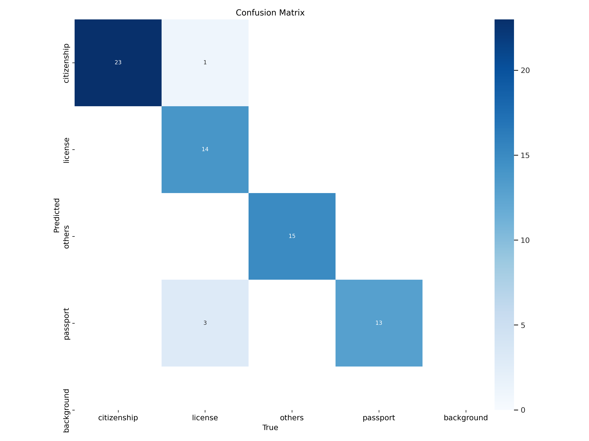
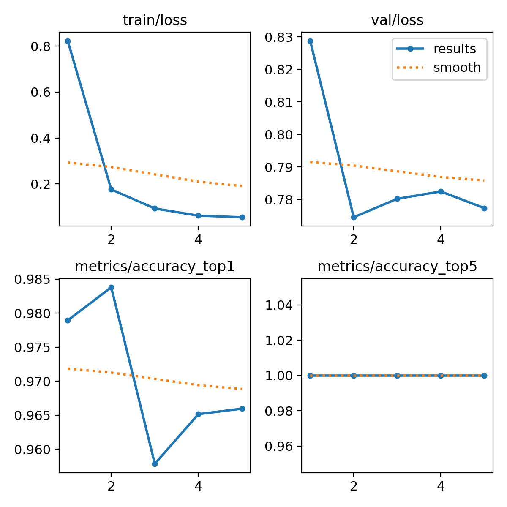
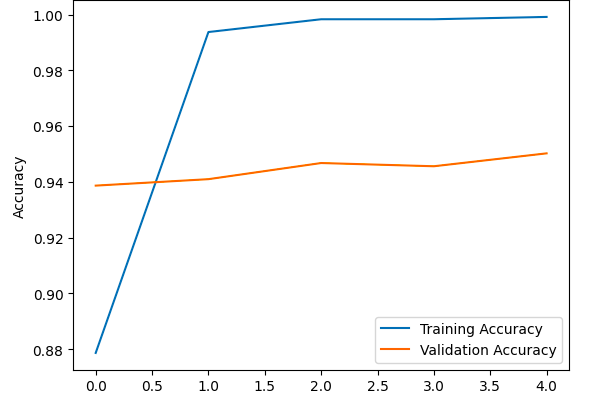
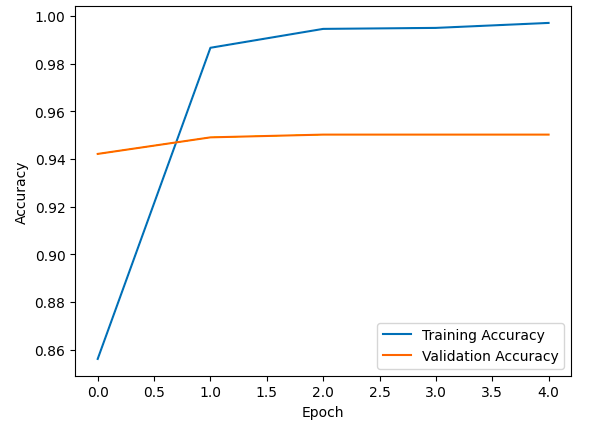

# Week 1

## Data Understanding

There are different types of data that can be used for feature extraction. We studied the different formats of data like pdf, docx, tiff, png, jpeg, and so on. The formats jpeg, png, tiff are the format types for the images, whereas docx, txt are used for text type. The pdf can contain both text and images.

## Data Collection

For the document classification, we collected images for each class (passport, citizenship, license, others) from Google. We performed various image preprocessing techniques such as wrapping, rescaling, resizing, adding noise, image enhancement using equalization, and performing geometric transformations for the images. About 30, 23, and 28 data points were collected from Google for citizenship, license, and passport respectively.

# Week 2

## Data Augmentation

As the dataset that was collected was too small, we must augment the data for the training purpose. Augmentation is the process of increasing the data by applying different image processing techniques in the currently available data. By performing the task like rotating, adding noise, up-scaling, down-scaling, lightening, wrapping and so on the data is being augmented.  We perform augmentation and prepare data set about 3625 for training and 1234 for validation set. The data are used for preparing the model.

# Week 3

## Training Model

We trained the data using the YOLO, VGG16, VGG19, Resnet50 and custom CNN model. All the are models constructed using convolution neural networks. The skip connection is present in the resnet so it is called residual network. VGG16 and VGG19  contain 16 and 19 neural networks respectively. After training the model the VGG model performed far better than resnet model. In about 5-10 epochs the VGG network has validation accuracy of 94% whereas after training 50 epochs the resnet has only 81% validation accuracy. Among the model used the YOLO perform exceptionally well. The resnet performs worst in our case. The metrices for the model are given below:

### Evaluation metrices

#### YOLO Model
<figure>
  
  <figcaption>Confusion metrices</figcaption>
</figure>
<figure>
  
  <figcaption>Results</figcaption>
</figure>

#### VGG model
<figure>
  
  <figcaption>Metrices for VGG16</figcaption>
</figure>
<figure>
  
  <figcaption>Metrices for VGG19</figcaption>
</figure>

### ResNet model
<figure>
  
  <figcaption>Results</figcaption>
</figure>

### Custom CNN
<figure>
  
  <figcaption>Results</figcaption>
</figure>

### Models

The model are available <a href='https://drive.google.com/file/d/178aHLpM_sxy_KZsvEBnidT-zFZwV173W/view?usp=sharing'> here </a>.

